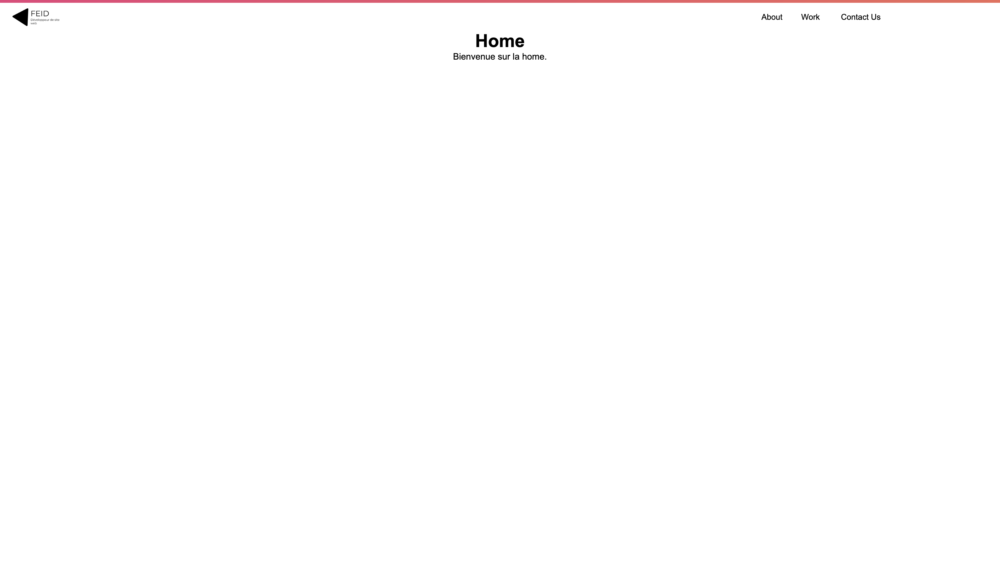

# Recette de cuisine

Ce projet est un simple framework php !


## Screenshots




## Déployer le projet

Cloner le projet

```bash
  git clone https://github.com/BroLegacy/framwork.git
```

Allez dans le dossier du projet

```bash
  cd framework
```

Installer les packages

```bash
  composer install
```

Allez dans le dossier public

```bash
  cd public
```

Lancer le serveur

```bash
  php -S 0.0.0.0:8888
```
## Authors

- [@BroLegacy](https://github.com/BroLegacy)

